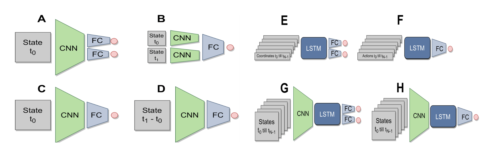

# Spatial Memory

Implementation and testing repository of several feedforward and recurrent methods for learning representations for simultaneous localisation and mapping. The repository contains the following models:

<table>
<tr>
<th>Model</th>
<th>Description</th>
</tr>
<tr>
<td>A</td>
<td>The top level directory that contains your app. If this option is used then
it assumed your scripts are in</td>
</tr>
<tr>
<td>B</td>
<td>By default, all modules are located relative to this path. If baseUrl is not
explicitly set, then all modules are loaded relative to the directory that holds
the build file. If appDir is set, then baseUrl should be specified as relative
to the appDir.</td>
</tr>
<tr>
<td>C</td>
<td>The directory path to save the output. If not specified, then the path will
default to be a directory called "build" as a sibling to the build file. All
relative paths are relative to the build file.</td>
</tr>
<tr>
<td>D</td>
<td>List the modules that will be optimized. All their immediate and deep
dependencies will be included in the module's file when the build is done. If
that module or any of its dependencies includes i18n bundles, only the root
bundles will be included unless the locale: section is set above.</td>
</tr>
</table>

