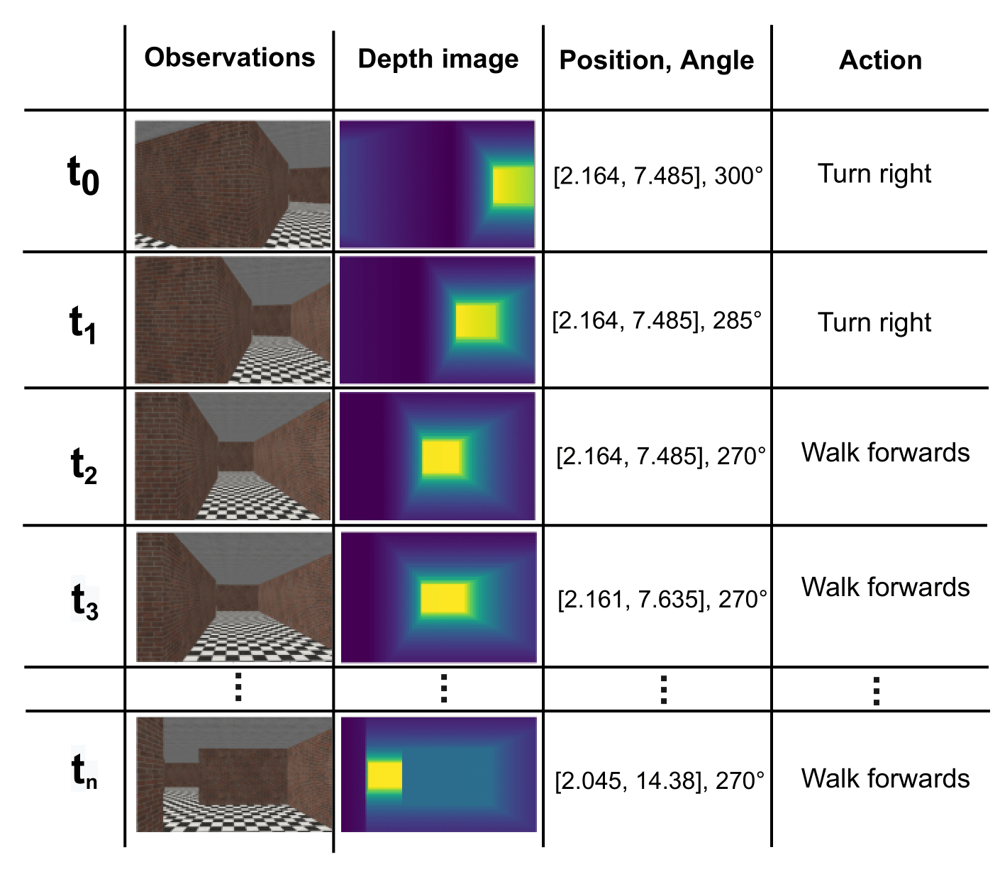

# Spatial Memory

Implementation and testing repository of several feedforward and recurrent methods for learning representations for simultaneous localisation and mapping.  

## Dataset
The datasets were created using the [Gym-Miniworld](https://github.com/Farama-Foundation/MiniWorld) a minimalistic 3D interior environment simulator. The create datasets contain first-person observations, a depth map, a bird's eye view perspective, the agent coordinates, orientation and the actions performed at each location.

  
## Models

The repository contains the following models:

<table>
<tr>
<th>Model</th>
<th>Task</th>
<th>Type</th>
<th>Description</th>
</tr>
<tr>
<td>A</td>
<td>Coordinate prediction</td>
<td>Feedforward</td>
<td>The top level directory that contains your app. If this option is used then
it assumed your scripts are in</td>
</tr>
<tr>
<td>B</td>
<td>Action prediction</td>
<td>Feedforward</td>
<td>By default, all modules are located relative to this path. If baseUrl is not
explicitly set, then all modules are loaded relative to the directory that holds
the build file. If appDir is set, then baseUrl should be specified as relative
to the appDir.</td>
</tr>
<tr>
<td>C</td>
<td>Action prediction</td>
<td>Feedforward</td>
<td>The directory path to save the output. If not specified, then the path will
default to be a directory called "build" as a sibling to the build file. All
relative paths are relative to the build file.</td>
</tr>
<tr>
<td>D</td>
<td>Action prediction</td>
<td>Feedforward</td>
<td>List the modules that will be optimized. All their immediate and deep
dependencies will be included in the module's file when the build is done. If
that module or any of its dependencies includes i18n bundles, only the root
bundles will be included unless the locale: section is set above.</td>
</tr>
</table>

## Usage

The results reported in the report are reproducible using the provided jupyter notebook. They run with little to no dependencies. First, the dataset generation notebook needs to be ran. The obtained datasets can then be used to train the models in notebooks A-H. 
